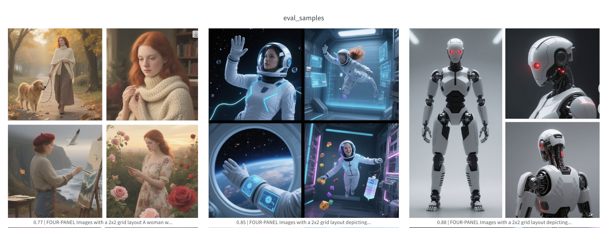
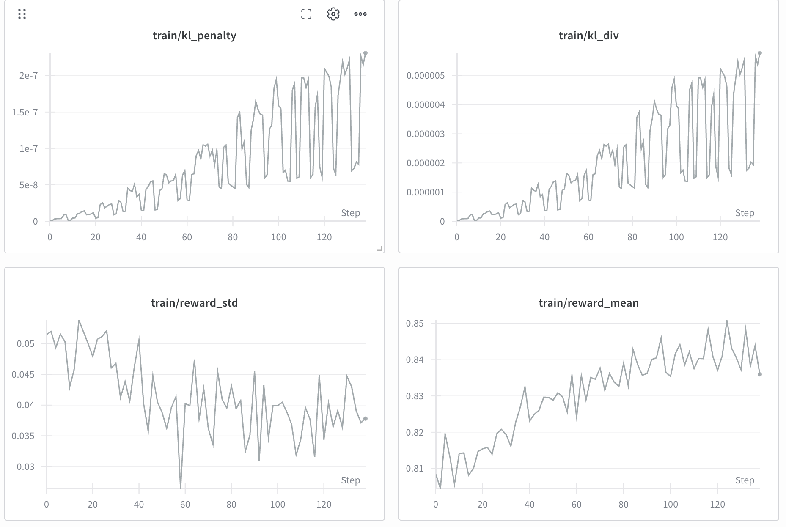

<h1 align="center"> Flow-Factory </h1>

<p align="center">
  <b>Easy Reinforcement Learning for Diffusion and Flow-Matching Models</b>
</p>

# Table of Contents

- [Supported Models](#-supported-models)
- [Supported Algorithms](#-supported-algorithms)
- [Get Started](#-get-started)
  - [Installation](#installation)
  - [Experiment Trackers](#experiment-trackers)
  - [Quick Start Example](#quick-start-example)
- [Dataset](#-dataset)
  - [Text-to-Image & Text-to-Video](#text-to-image--text-to-video)
  - [Image-to-Image & Image-to-Video](#image-to-image--image-to-video)
  - [Video-to-Video](#video-to-video)
- [Acknowledgements](#acknowledgements)

# 🤗 Supported Models

| Model | Model Size | Model Type |
|-------|------------|-----------|
| [FLUX.1-Dev](https://huggingface.co/black-forest-labs/FLUX.1-dev) | 13B | flux1 |
| [FLUX.2-dev](https://huggingface.co/black-forest-labs/FLUX.2-dev) | 30B | flux2 |
| [Z-Image-Turbo](https://huggingface.co/Tongyi-MAI/Z-Image-Turbo) | 12B | z-image |
| [Qwen-Image](https://huggingface.co/Qwen/Qwen-Image) | 20B | qwen-image |
| [Qwen-Image-2512](https://huggingface.co/Qwen/Qwen-Image-2512) | 20B | qwen-image |
| [Qwen-Image-Edit-2509](https://huggingface.co/Qwen/Qwen-Image-Edit-2509) | 20B | qwen-image-edit-plus |
| [Qwen-Image-Edit-2511](https://huggingface.co/Qwen/Qwen-Image-Edit-2511) | 20B | qwen-image-edit-plus |


# 💻 Supported Algorithms

- GRPO. See [here](link) for detailed guidance.

- Diffusion-NFT. See [here](link) for detailed guidance.

# 🚀 Get Started

## Installation

```bash
git clone https://github.com/Jayce-Ping/Flow-Factory.git
cd Flow-Factory
pip install -e .
```

Optional dependencies, such as `deepspeed`, are also available. Install them with:

```bash
pip install -e .[deepspeed]
```

## Experiment Trackers

To use [Weights & Biases](https://wandb.ai/site/) or [SwanLab](https://github.com/SwanHubX/SwanLab) to log experimental results, install extra dependencies via `pip install -e .[wandb]` or `pip install -e .[swanlab]`.

> [SwanLab](https://github.com/SwanHubX/SwanLab) is recommended for users in mainland China.

These trackers allow you to visualize both **training samples** and **metric curves** online:






## Quick Start Example

Start training with the following simple command:

```bash
ff-train examples/grpo/lora/flux.yaml
```


# 📊 Dataset

The unified structure of dataset is:

```plaintext
|---- dataset
|----|--- train.txt / train.jsonl
|----|--- test.txt / test.jsonl (optional)
|----|--- images (optional)
|----|---| image1.png
|----|---| ...
|----|--- videos
|----|---| video1.mp4
|----|---| ...
```

## Text-to-Image & Text-to-Video

For text-to-image and text-to-video tasks, the only required input is the **prompt** in plain text format. Use `train.txt` and `test.txt` (optional) with following format:

```
A hill in a sunset.
An astronaut riding a horse on Mars.
```

Each line represents a single text prompt. Alternatively, you can use `train.jsonl` and `test.jsonl` in the following format:

```jsonl
{"prompt": "A hill in a sunset."}
{"prompt": "An astronaut riding a horse on Mars."}
```

## Image-to-Image & Image-to-Video

For tasks involving conditioning images, use `train.jsonl` and `test.jsonl` in the following format:

```jsonl
{"prompt": "A hill in a sunset.", "image": "path/to/image1.png"}
{"prompt": "An astronaut riding a horse on Mars.", "image": "path/to/image2/png"}
```

The default root directory for images is `dataset_dir/images`, and for videos, it is `dataset_dir/videos`. You can override these locations by setting the `image_dir` and `video_dir` variables in your `config` file:

```yaml
data:
    dataset_dir: "path/to/dataset"
    image_dir: "path/to/image_dir" # (default to "{dataset_dir}/images")
    video_dir: "path/to/video_dir" # (default to "{dataset_dir}/videos")
```

For models like [FLUX.2-dev]((https://huggingface.co/black-forest-labs/FLUX.2-dev)) and [Qwen-Image-Edit-2511]((https://huggingface.co/Qwen/Qwen-Image-Edit-2511)) that are able to accept multiple images as conditions, use the `images` key with a list of image paths:

```jsonl
{"prompt": "A hill in a sunset.", "images": ["path/to/condition_image_1_1.png", "path/to/condition_image_1_2.png"]}
{"prompt": "An astronaut riding a horse on Mars.", "image": ["path/to/condition_image_2_1.png", "path/to/condition_image_2_2.png"]}
```

## Video-to-Video

```jsonl
{"prompt": "A hill in a sunset.", "video": "path/to/video1.png"}
{"prompt": "An astronaut riding a horse on Mars.", "videos": ["path/to/video2.png", "path/to/video3.png"]}
```


# Acknowledgements

This repository is based on [diffusers](https://github.com/huggingface/diffusers/), [accelerate](https://github.com/huggingface/accelerate) and [peft](https://github.com/huggingface/peft).
We thank them for their contributions to the community!!